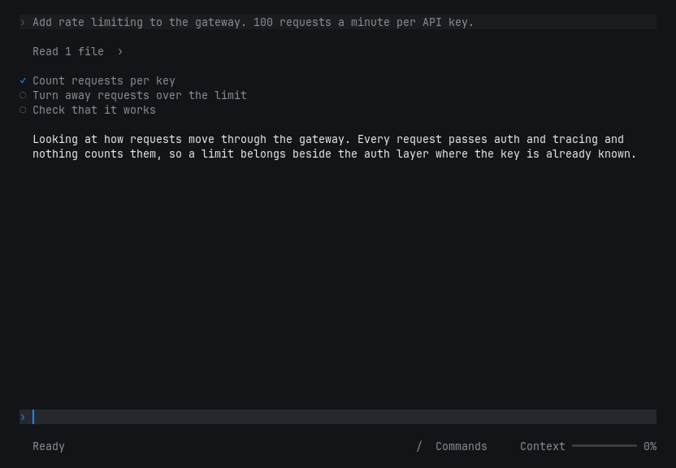
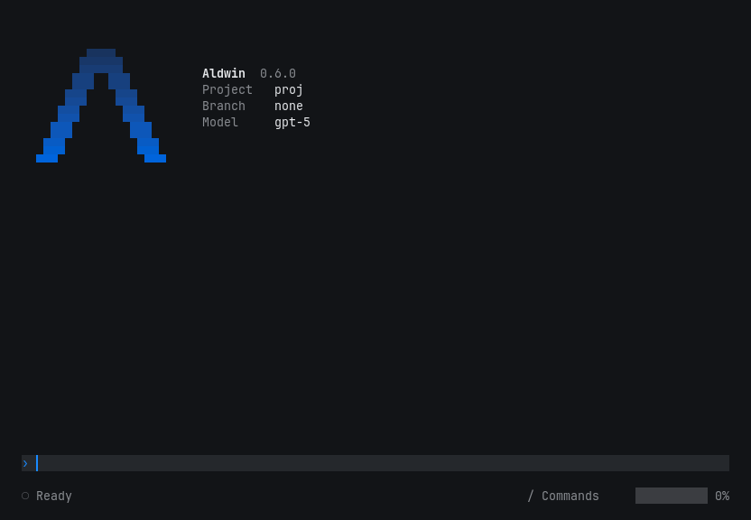
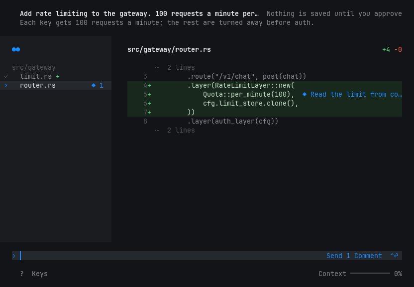

# Aldwin

*You decide what gets written.*

Aldwin is a coding agent for your terminal, for developers who want more of
a say in how the code in their project is shaped.

It reads your code and runs commands freely, and a command can only write
inside your workspace. What Aldwin never does is edit your code on its own.
Every edit waits in a review, and nothing lands until you've read it and
approved it. You keep control of what gets written, and you keep your
understanding of the code along the way.



> **Status:** 0.4.0. Early, moving fast, and used daily to build itself.
> Linux and Apple Silicon.

## Why use it

Most agents are built to take work off your hands. That's great right up
until the codebase you're responsible for is full of code you never actually
read. Every change you wave through is a little less of the code you
understand, and a little less of it shaped the way you'd have shaped it.

Aldwin keeps you in every change:

- **You review every edit, always.** Edits from a turn are collected into
  one changeset and shown to you in a full-window review. You can't turn
  this off, and there's no auto-approve mode to forget about.
- **You shape it before it lands.** Comment on any line and send it back.
  The agent reworks it and stages it again, and nothing goes in until it's
  the way you want it.
- **Reading and running don't get in your way.** The agent reads and runs
  whatever it needs without asking, and a command can only write inside your
  workspace. The only thing you're asked about is what actually changes your
  code.
- **It shows its work.** Its plan is a few plain steps, and what it read and
  ran is one line away, down to the exact paths and commands.

If you want an agent to churn through tickets unattended, this isn't it. If
you want a say in every line that lands in your project, it is.

## Is it safe to point at my repo?

Here's what Aldwin guarantees:

- **Nothing is written without your approval.** The edit tool only stages
  changes, and the only thing that writes them is you approving the review.
- **Commands can't write outside your project.** Every command it runs, and
  every language server and MCP server it starts, runs in a sandbox that can
  only write inside your project (plus temp files and build caches like
  `~/.cargo`). The kernel enforces this: Landlock on Linux, Seatbelt on
  macOS.
- **MCP servers can't write your project at all.** If a server wants a file
  changed, the agent makes that change as an edit, and you review it.
- **It tells you when it can't keep a promise.** On a system that can't
  sandbox anything, Aldwin runs unconfined and tells you once, at startup.

And here's what it doesn't do, so you're not surprised:

- **Commands can still write inside your project.** A `run` of `rm` in your
  own tree is still a `rm`. That's what git is for.
- **Reads and the network are open.** A command can read your files and
  reach the internet. The sandbox keeps your files from changing behind
  your back. It doesn't keep them secret.
- **A project under `/tmp` or `~/.cache` isn't protected**, because every
  process can write there anyway.

## What it can do

The agent has a small, fixed set of tools:

| tool | does |
| --- | --- |
| `read` | reads files in your project |
| `run` | runs a shell command (pipes, `&&` and all) in the sandbox |
| `edit` | stages a change for your review |
| `explain` | asks the language server about a symbol (Rust, through rust-analyzer) |
| `plan` | shows you the plan, and keeps it up to date |
| `ask` | asks you one question, with a short list of answers |

On top of those you can add your own tools through MCP servers (stdio).
If your project has a `CLAUDE.md` or `AGENTS.md`, the agent reads it.

Conversations are saved as you go, and `/resume` picks one back up where
you left off.

What it doesn't have: web search, image input, background or parallel
agents, and memory that carries across sessions on its own. Some of that
will come. Some of it is on purpose.

## Models and cost

Bring your own model. You pay your provider directly, and Aldwin never
sees a bill.

- **Built in:** Anthropic, OpenAI, Google, xAI, Mistral and DeepSeek, each
  with a couple of suggested models. You can type any model id.
- **Anything OpenAI-compatible:** point `provider.yaml` at the endpoint.
- **SuperGrok:** `/connect` signs in to your xAI account, so you can use
  your subscription instead of an API key.

Prompt caching is on for Anthropic, which keeps long sessions cheaper.

## Install

```sh
curl -fsSL https://raw.githubusercontent.com/hvess/aldwin-agent/main/install.sh | sh
```

It picks the build for your machine, checks it against the release's
checksums and signature, and puts `aldwin` in `~/.local/bin`. If either
check fails, nothing gets installed. Set `ALDWIN_INSTALL_DIR` to put it
somewhere else, or `ALDWIN_VERSION` (say `v0.4.0`) to pin a release.
[`install.sh`](install.sh) is short, so give it a read first if you like.

Rather do it by hand? Grab the archive for your machine from
[Releases](../../releases), extract it, and put `aldwin` on your `PATH`.

| archive | for |
| --- | --- |
| `…-x86_64-unknown-linux-gnu.tar.gz` | Linux (Intel/AMD) |
| `…-aarch64-apple-darwin.tar.gz` | Apple Silicon Macs |

No Windows and no Intel Macs, for now.

<details>
<summary>Checking the download</summary>

Every release ships a `SHA256SUMS` and a signature over it. Take
`allowed_signers` from this repo, not from the release page. A key sitting
next to its own signature proves nothing.

```sh
ssh-keygen -Y verify -f allowed_signers \
  -I release@aldwin -n aldwin-release \
  -s SHA256SUMS.sig < SHA256SUMS
sha256sum -c SHA256SUMS
```

Releases from before the rename were signed as `release@mjolnir` /
`mjolnir-release`. It's the same key, and `allowed_signers` has both.

</details>

<details>
<summary>Building from source</summary>

You'll need [rustup](https://rustup.rs), because `rust-toolchain.toml` pins
the compiler and only rustup reads it.

```sh
cargo install --path crates/cli
```

Release builds are reproducible. Check out a tag, run
`scripts/release.sh build <target>` and then `scripts/release.sh package`, and
you get the same bytes as the release. The macOS archive only reproduces on
a Mac.

</details>

## Your first session

```sh
cd your-project
aldwin
```



Just type what you want. On first run Aldwin holds your message, asks which
provider and model to use, and then sends it. Your API key stays in your
environment: the config only stores the *name* of the variable
(`ANTHROPIC_API_KEY`, say), never the key.

When the agent wants to change something, the review opens:



Click or drag to select lines, `↩` to comment, and `⌃↩` to send your
comments back or to approve once you've read every file. `?` shows every
key.

## Your data

- **No telemetry.** Aldwin talks to your model provider, to xAI if you
  `/connect`, and to the MCP servers you configure. Nothing else.
- **Keys aren't stored.** API keys stay in your environment. A `/connect`
  sign-in is kept in `~/.aldwin/connections.yaml`, and deleting its entry
  disconnects you.
- **History is yours.** Each session is saved under `~/.aldwin/history/`,
  readable only by you. Nothing prunes it and nothing summarizes it, so
  it's your call when to delete it.

## Reference

### Keys

| key | does |
| --- | --- |
| `↩` / `⇧↩` | send / new line (`⌃J` if your terminal can't tell them apart) |
| `⎋` | stop the running turn |
| `⌃C` | stop the turn, or quit if nothing's running |
| `Space` | show or hide what the current turn read and ran (on an empty field) |
| `1`–`9` | answer a question |

### Commands

Type `/` on an empty field: `/resume`, `/model`, `/connect`, `/clear`,
`/theme`, `/quit` (or `/exit`). `/reload-config` and `/help` work too.

### Config

Commented YAML, global in `~/.aldwin/` and per project in `.aldwin/`.
Aldwin writes the first set for you, so you only need to open them if you
want to change something.

| file | holds |
| --- | --- |
| `provider.yaml` | provider, model, and the name of the key's variable |
| `permissions.yaml` | extra folders the agent may work in (project only) |
| `mcp.yaml` | MCP servers |
| `tui.yaml` | light or dark theme (global only) |
| `connections.yaml` | `/connect` sign-ins (global only) |

A custom OpenAI-compatible endpoint:

```yaml
version: 1
provider: openai-compatible
model: mistral-small-latest
base_url: https://api.mistral.ai/v1/chat/completions
api_key_env: MISTRAL_API_KEY
```

Letting the agent work across a sibling checkout too:

```yaml
roots:
  - ../shared-lib
```

## Contributing

It's a Cargo workspace. The agent loop is in `crates/core`, the UI in
`crates/tui`, and the binary in `crates/cli`.

```sh
cargo test --workspace
cargo clippy --workspace --all-targets -- -D warnings
```

Design notes live in `docs/spec/`, and the decisions behind them in
`docs/adr/`. There's usually a reason things are the way they are, and
it's usually written down there.

Working on it with an agent? Point it at `AGENTS.md`. Every agent commit
goes through the review loop in `.agents/skills/review/`, and the
pre-commit hook enforces it.

## License

MIT. See [LICENSE](LICENSE).
