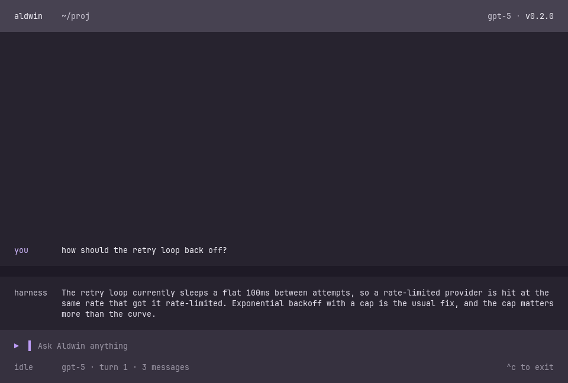
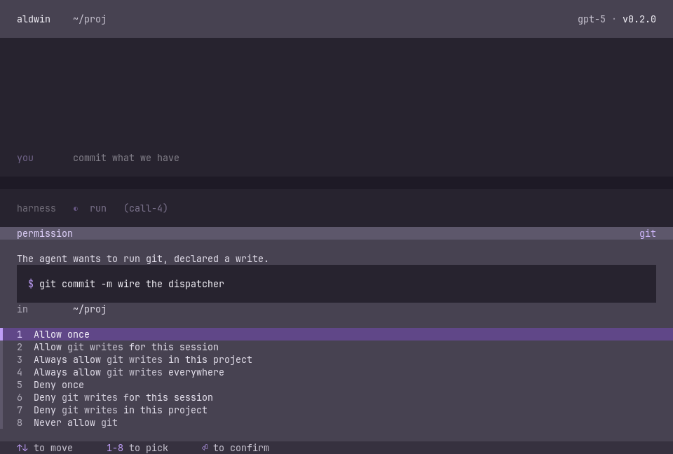
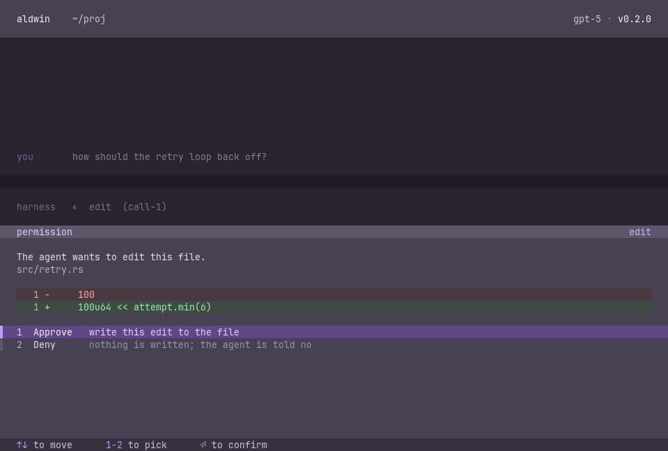

# Aldwin

*A tool for thought.*

A terminal coding agent that would rather explain the code than rewrite it
behind your back. It reads, it reasons, it proposes — and it edits only when
you say so. Every write shows you a diff first. Every command asks before it
runs. The point is that **you** finish the session understanding the code,
not just holding a larger diff than when you started.



Built in Rust on [ratatui](https://ratatui.rs). Works with Anthropic or any
OpenAI-compatible endpoint.

> **Status:** 0.2.0 and actively developed. Linux is the best-supported
> platform — see the macOS note under Install.

## Install

Grab a binary from [Releases](../../releases), extract, put `aldwin` on your
`PATH`. No toolchain required. (The repo is private, so you'll need access.)

| archive | for |
| --- | --- |
| `…-x86_64-unknown-linux-gnu.tar.gz` | Intel/AMD Linux |
| `…-aarch64-apple-darwin.tar.gz` | Apple Silicon Macs |

No Intel Mac build. No Windows — `run` leans on Unix process APIs.

**macOS caveat worth knowing before you install:** the sandbox that enforces
a read-only call is Linux-only (Landlock). On macOS there's nothing to hold a
call to its word, so instead of quietly trusting it, Aldwin asks about every
call. Safe, correct, and noticeably chattier.

### Verify what you downloaded

Each release ships `SHA256SUMS` and a signature over it. Take
`allowed_signers` from **this repo**, not the release page — a key served
next to its own signature proves nothing.

```sh
ssh-keygen -Y verify -f allowed_signers \
  -I release@aldwin -n aldwin-release \
  -s SHA256SUMS.sig < SHA256SUMS

sha256sum -c SHA256SUMS
```

No new tools: `ssh-keygen` came with SSH.

For a release published before the project was renamed, swap in the old pair
— `-I release@mjolnir -n mjolnir-release`. It is the same key; only the
labels changed, and `allowed_signers` carries both.

This matters more here than for most downloads. Aldwin's whole pitch is that
its `edit` tool can't write without your say-so and that a read is enforced
rather than trusted — none of which survives running a binary that isn't the
one built from the source you can read.

### Build from source

Needs [rustup](https://rustup.rs) — `rust-toolchain.toml` pins the compiler
to 1.98.1, and only rustup honours it.

```sh
cargo install --path crates/cli   # or: cargo build --release
```

Release builds are reproducible: pinned compiler, `Cargo.lock`, source paths
remapped out of the binary, no timestamps in the archive. Rebuilding a tag
gives byte-identical archives.

```sh
git checkout vX.Y.Z
scripts/release.sh build x86_64-unknown-linux-gnu
scripts/release.sh package
sha256sum -c SHA256SUMS      # the one from the release
```

Two honest limits: the macOS archive only reproduces *on a Mac* (Apple's SDK
licence), and without rustup the compiler pin does nothing — the script says
so rather than letting you wonder why the hashes differ.

## Run

```sh
export ANTHROPIC_API_KEY=sk-...
aldwin
```

That's the whole CLI. No flags, no subcommands, nothing but `--help` and
`--version`. Everything else lives in config files.

**First launch** asks where the model runs, which one, and how much access
this directory gets — then drops you straight into the session. Answers go to
`~/.aldwin/` (global) and `.aldwin/` (this project), both fully commented,
both meant to be read and edited.

Aldwin never stores your API key. `provider.yaml` holds the *name* of an
environment variable, and reads it at startup. For an OpenAI-compatible
endpoint:

```yaml
version: 1
provider: openai-compatible
model: mistral-small-latest
base_url: https://api.mistral.ai/v1/chat/completions
api_key_env: MISTRAL_API_KEY
```

(`base_url` is ignored for `provider: anthropic`, which knows its own address.)

If the project has a `CLAUDE.md` or `AGENTS.md`, you're asked once — before
anything launches — whether it goes in the model's context. Nothing is read
into context that you didn't approve.

## Permissions

Everything starts denied. The allowlist grows as you hit things, so your
first session in a new project asks about almost everything and then settles
down quickly.



**A grant is a program and a class** — `git: read`, `cargo: write`. The class
belongs to the *call*, not the program, because `git status` and `git push`
are very different requests to the same binary.

**There is no shell.** A call is a program plus an argument list, executed
directly. `&&`, `|`, `;` and `$(…)` are just characters, with no power to
staple a second command onto an approved first one.

**A read is enforced, not believed.** When the agent declares a call a read,
it runs with your tree read-only and the network unreachable. Declare wrong
and nothing lands — you get asked whether to allow it as a write instead. A
mistaken declaration costs a prompt, not a repository. *(Linux only; see the
macOS note above.)*

**A deny is a lock.** Nothing narrower overrides it — not a session, not a
turn, not the other config file. A locked call is refused without a prompt,
because there's no answer that would change it. Unlocking is a deliberate
edit to the file holding it.

Each scope also has a standing rung — `ask`, `read`, `write` — for anything
no rule covers, and the narrower file wins.

### Edits are outside all of that

Not a grant, not a rung, not a row on any prompt. Every edit shows a diff and
waits, under every setting, with no way to switch it off.



The one gap, stated plainly: this covers Aldwin's own `edit` tool. An MCP
server's tools are its own code, and Aldwin can't render a diff for a write
it doesn't understand the shape of.

## Sessions

Conversations are written to disk as they happen, one JSONL transcript per
session under `~/.aldwin/history/`, mode `0600`. `/resume` lists past
sessions in this project and picks one back up — into the transcript you see
*and* the context the model has.

Nothing crosses between sessions on its own. Resume is something you ask for,
by name; there's no cross-session memory and nothing gets summarised behind
your back. A resumed session re-asks for permissions rather than inheriting
them.

Nothing prunes old transcripts yet. They're your files, in a directory you
own.

## Keys and commands

| key | does |
| --- | --- |
| `Enter` / `Shift+Enter` | submit / newline (`Ctrl+J` where the terminal can't tell them apart) |
| `Ctrl+C` | cancel the turn, or exit if nothing is running |
| `↑` `↓` | move within a multi-line draft, then scroll the transcript |
| `PgUp` `PgDn` `End` | scroll; `End` returns to the live end when the input is empty |
| `1`–`9`, `Enter` | pick and confirm in any prompt or picker |

The mouse wheel scrolls too — the terminal keeps the mouse, so selecting and
copying text works the way it does anywhere else.

`/help` lists the commands: `/clear`, `/exit`, `/model`, `/reload-config`,
`/resume`, `/theme light|dark`. Bare `/model` and `/resume` open a picker
instead of expecting you to know the answer.

## Layout

Cargo workspace, eight crates. `aldwin-review` is a dev-only harness that
lints, tests and screenshots the TUI, and never reaches a release build —
the release workflow builds `-p aldwin-cli` and nothing else. Traits live in
the crate owning the boundary, impls in the siblings that depend on it.

| crate | role |
| --- | --- |
| `aldwin-core` | agent loop, conversation log, event/command types, `LlmClient` and `ToolDispatcher` traits |
| `aldwin-config` | YAML config per domain, project and global scope, refuses to start on a half-deleted one |
| `aldwin-permissions` | the default-deny engine |
| `aldwin-tools` | read, edit, run, explain (LSP), the read-enforcing sandbox, MCP bridge |
| `aldwin-llm` | Anthropic and OpenAI-compatible clients — reqwest, SSE, retry, prompt caching |
| `aldwin-tui` | the ratatui frontend |
| `aldwin-cli` | the `aldwin` binary — startup, wiring, slash commands |
| `aldwin-review` | dev-only: the review loop and screenshot harness |

Design notes live in `.claude/spec/`, and decisions that changed a stated
constraint in `.claude/adr/`. Read the relevant one before changing a crate.

## Development

```sh
cargo test --workspace
cargo clippy --workspace --all-targets -- -D warnings
```

Two tests are `#[ignore]`d because they spawn a real `rust-analyzer`:

```sh
cargo test -p aldwin-tools -- --ignored
```

`cargo run -p aldwin-review -- review --goal "…" --focus "…"` runs the full
loop — lint, tests, design tokens, frame snapshots, and screenshots of the
real binary driven through a real terminal.
